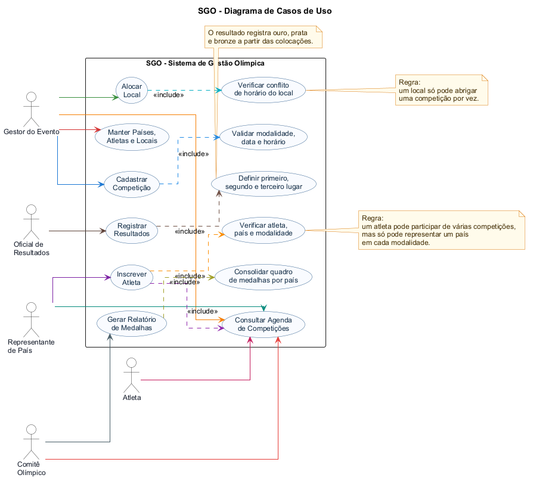
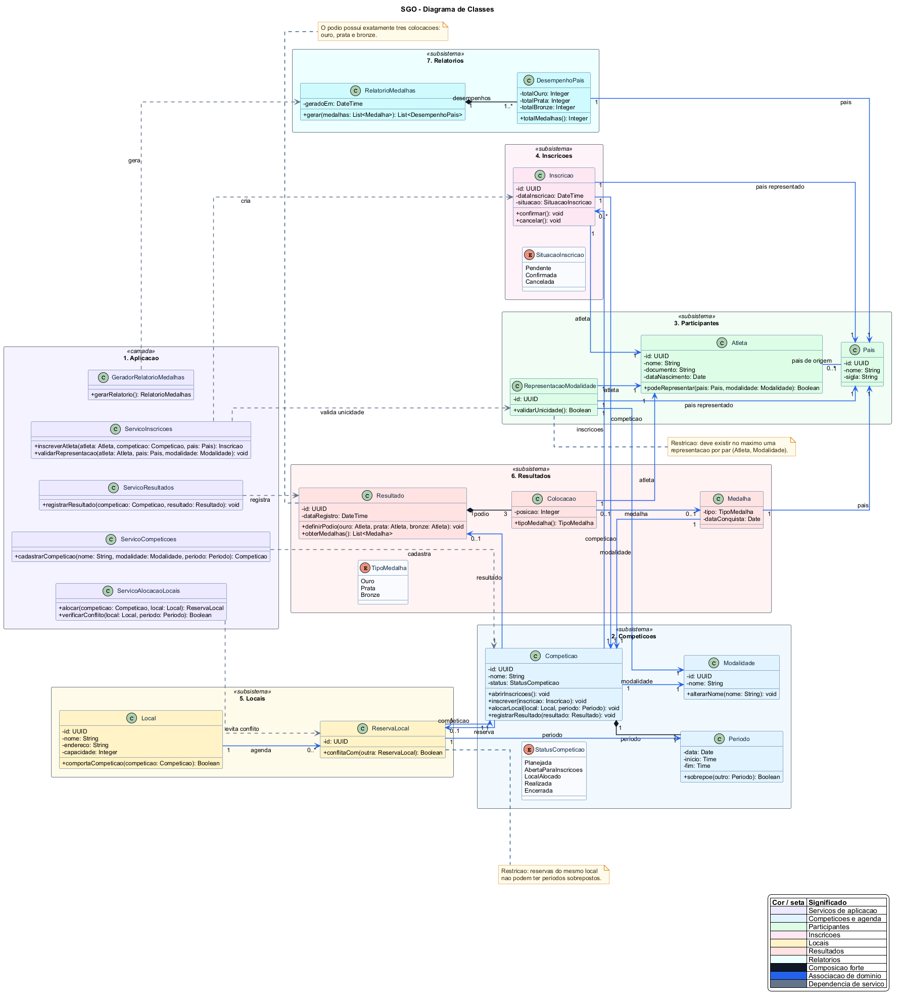
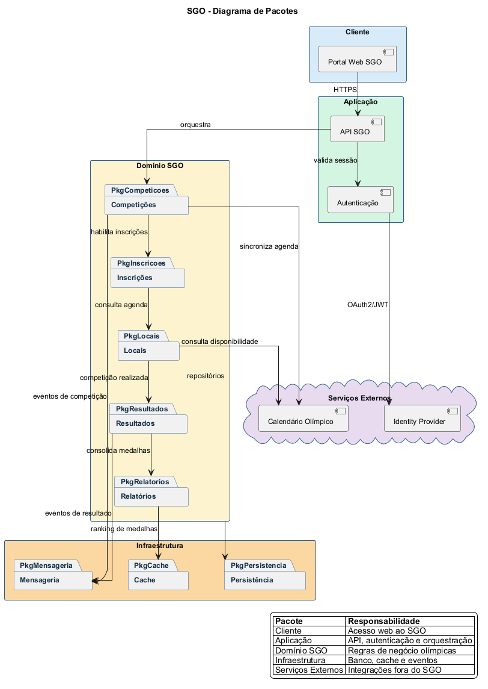
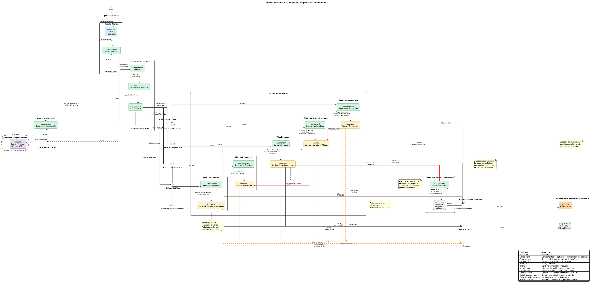
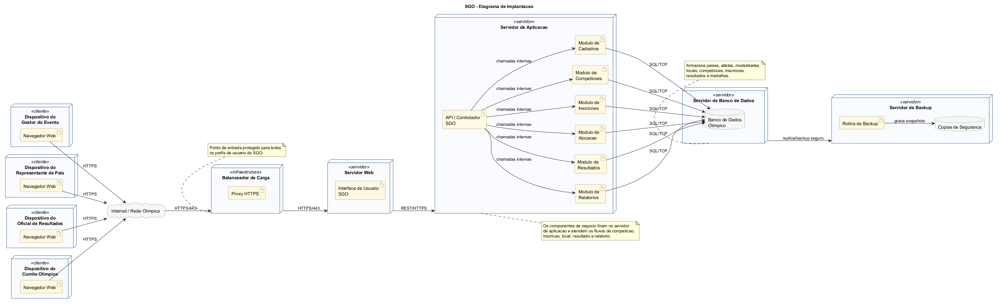

# SGO - Sistema de Gestão das Olimpíadas

Repositório de modelagem do Sistema de Gestão das Olimpíadas (SGO), contendo os diagramas UML do projeto e a documentação das principais histórias de usuário.

## Objetivo

O SGO apoia a organização de competições olímpicas, permitindo cadastrar competições, inscrever atletas, alocar locais sem conflito de horário, registrar resultados e gerar relatórios de medalhas por país.

## Histórias de Usuário

**US01 - Manter cadastros base**  
Como gestor do evento, quero cadastrar e manter países, atletas, modalidades e locais, para que o sistema possua os dados necessários para organizar as competições.

**US02 - Cadastrar competição**  
Como gestor do evento, quero cadastrar uma competição informando modalidade, data, horário, local e atletas envolvidos, para que ela possa ser planejada e acompanhada pelo SGO.

**US03 - Inscrever atleta**  
Como representante de país, quero inscrever atletas em competições, para que eles possam participar das modalidades disponíveis respeitando as regras de representação.

**US04 - Validar representação do atleta**  
Como sistema, quero validar o país representado pelo atleta em cada modalidade, para impedir que um atleta represente mais de um país na mesma modalidade.

**US05 - Alocar local da competição**  
Como gestor do evento, quero alocar um local para uma competição, para garantir que ela tenha espaço definido e que não exista conflito de horário com outra competição.

**US06 - Consultar agenda**  
Como gestor, atleta ou representante, quero consultar a agenda das competições, para acompanhar datas, horários e locais das disputas.

**US07 - Registrar resultados**  
Como oficial de resultados, quero registrar o primeiro, segundo e terceiro lugar de uma competição, para que o sistema registre ouro, prata e bronze corretamente.

**US08 - Gerar relatório de medalhas**  
Como comitê olímpico, quero gerar um relatório de medalhas por país, para acompanhar o desempenho das delegações.

**US09 - Autenticar usuários**  
Como usuário do sistema, quero acessar o SGO por meio de autenticação segura, para que somente perfis autorizados executem operações sensíveis.

## Diagramas

### Diagrama de Caso de Uso



Código-fonte: [`codigos/diagrama-de-caso-de-uso.puml`](codigos/diagrama-de-caso-de-uso.puml)

### Diagrama de Classes



Código-fonte: [`codigos/diagrama-de-classes.puml`](codigos/diagrama-de-classes.puml)

### Diagrama de Pacotes



Código-fonte: [`codigos/diagrama-de-pacotes.puml`](codigos/diagrama-de-pacotes.puml)

### Diagrama de Componentes



Código-fonte: [`codigos/diagrama-de-componentes.puml`](codigos/diagrama-de-componentes.puml)

### Diagrama de Implantação



Código-fonte: [`codigos/diagrama-de-implantação.puml`](codigos/diagrama-de-implantação.puml)

## Estrutura do Repositório

```text
.
|-- README.md
|-- imagens/
|   |-- diagrama-de-caso-de-uso.png
|   |-- diagrama-de-classes.png
|   |-- diagrama-de-pacotes.png
|   |-- diagrama-de-componentes.png
|   `-- diagrama-de-implantação.png
`-- codigos/
    |-- diagrama-de-caso-de-uso.puml
    |-- diagrama-de-classes.puml
    |-- diagrama-de-pacotes.puml
    |-- diagrama-de-componentes.puml
    `-- diagrama-de-implantação.puml
```

## Tecnologias de Modelagem

- UML
- PlantUML
- Diagramas de caso de uso, classes, pacotes, componentes e implantação
